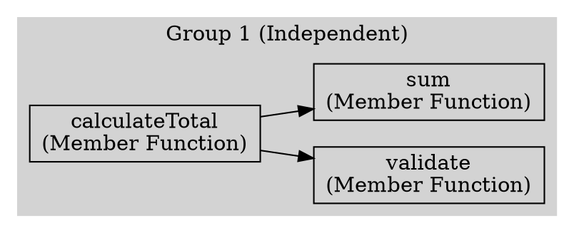

# CLI Interface Contract

## Overview

This document defines the command-line interface contract for the C++ Function Grouper tool. The contract specifies the exact command-line arguments, options, exit codes, and output formats that users can rely on.

## Command Structure

```bash
function-grouper [OPTIONS] <input-file>
```

## Arguments

### Required Arguments

#### `<input-file>`
- **Type**: File path (string)
- **Description**: Path to the C++ implementation file (.cpp) to analyze
- **Validation**:
  - File must exist
  - File must be readable
  - File extension should be `.cpp` (warning if not)
  - File size < 100MB (hard limit)
- **Examples**:
  - `function-grouper my_code.cpp`
  - `function-grouper /path/to/project/main.cpp`

## Options

### Output Format Options

#### `-f, --format <FORMAT>`
- **Type**: Choice (enum)
- **Values**: `json`, `text`, `dot`
- **Default**: `text`
- **Description**: Output format for the analysis results
- **Examples**:
  - `-f json` - Machine-readable JSON output
  - `--format text` - Human-readable text report
  - `-f dot` - Graphviz DOT format for visualization

#### `-o, --output <FILE>`
- **Type**: File path (string)
- **Default**: stdout
- **Description**: Write output to specified file instead of stdout
- **Behavior**:
  - If file exists, prompt for overwrite confirmation (unless `--force`)
  - Create parent directories if needed
  - Write to stdout if not specified
- **Examples**:
  - `-o results.json`
  - `--output /tmp/analysis.txt`

### Analysis Options

#### `--std <VERSION>`
- **Type**: Choice (enum)
- **Values**: `c++11`, `c++14`, `c++17`, `c++20`, `c++23`
- **Default**: `c++17`
- **Description**: C++ standard version to use for parsing
- **Examples**:
  - `--std c++20`
  - `--std c++17`

#### `-I, --include <PATH>`
- **Type**: Directory path (string, repeatable)
- **Default**: Empty list
- **Description**: Add directory to include search path (can be specified multiple times)
- **Examples**:
  - `-I /usr/include`
  - `--include ./headers -I ../common/include`

### Display Options

#### `--progress / --no-progress`
- **Type**: Boolean flag
- **Default**: `--progress` (enabled)
- **Description**: Show/hide progress indication during analysis
- **Behavior**:
  - `--progress`: Display percentage and phase (parsing/analyzing/outputting)
  - `--no-progress`: Silent operation (except errors)
- **Examples**:
  - `--no-progress` - For use in CI/CD pipelines
  - `--progress` - Default for interactive use

#### `-v, --verbose`
- **Type**: Count (incremental)
- **Default**: 0 (normal verbosity)
- **Description**: Increase output verbosity (can be repeated)
- **Levels**:
  - 0 (default): Errors and warnings only
  - 1 (`-v`): Info messages (files parsed, groups found)
  - 2 (`-vv`): Debug messages (each function processed)
  - 3 (`-vvv`): Trace messages (detailed AST traversal)
- **Examples**:
  - `-v` - Info level
  - `-vv` - Debug level
  - `--verbose --verbose --verbose` - Trace level

#### `-q, --quiet`
- **Type**: Boolean flag
- **Default**: False
- **Description**: Suppress all output except errors
- **Conflicts**: Mutually exclusive with `--verbose`

### Error Handling Options

#### `--strict / --no-strict`
- **Type**: Boolean flag
- **Default**: `--no-strict` (lenient)
- **Description**: Enable/disable strict parsing mode
- **Behavior**:
  - `--strict`: Fail completely if any function cannot be parsed
  - `--no-strict`: Continue with partial analysis, report unparseable functions
- **Examples**:
  - `--strict` - For validation/testing
  - `--no-strict` - For analyzing real-world code (default)

### Utility Options

#### `-h, --help`
- **Type**: Boolean flag
- **Description**: Show help message and exit
- **Behavior**: Display usage, options, and examples, then exit with code 0

#### `--version`
- **Type**: Boolean flag
- **Description**: Show version information and exit
- **Output Format**:
  ```
  function-grouper version X.Y.Z
  libclang version A.B.C
  Python version M.N.P
  ```

#### `--force`
- **Type**: Boolean flag
- **Default**: False
- **Description**: Overwrite output file without confirmation

## Exit Codes

| Code | Name | Description |
|------|------|-------------|
| 0 | SUCCESS | Analysis completed successfully |
| 1 | GENERAL_ERROR | Unspecified error occurred |
| 2 | FILE_NOT_FOUND | Input file does not exist |
| 3 | FILE_READ_ERROR | Input file cannot be read (permissions, encoding) |
| 4 | PARSE_ERROR | Parsing failed in strict mode |
| 5 | INVALID_ARGUMENTS | Invalid command-line arguments |
| 6 | OUTPUT_ERROR | Cannot write to output file |
| 7 | MEMORY_EXCEEDED | Memory usage exceeded 2GB limit |
| 8 | TIMEOUT | Analysis exceeded maximum time limit |

## Standard Output Formats

### JSON Format (`-f json`)

```json
{
  "metadata": {
    "source_file": "/path/to/file.cpp",
    "parse_timestamp": "2025-10-25T12:34:56Z",
    "total_functions": 100,
    "successfully_parsed": 98,
    "failed_to_parse": 2,
    "total_call_edges": 250,
    "total_groups": 15,
    "independent_groups": 10,
    "largest_group_size": 25,
    "analysis_duration_seconds": 2.5,
    "memory_used_mb": 45.2
  },
  "functions": [
    {
      "name": "calculateTotal",
      "qualified_name": "Calculator::calculateTotal",
      "signature": "double Calculator::calculateTotal(const std::vector<double>& values)",
      "location": {
        "file": "/path/to/file.cpp",
        "line": 42,
        "column": 5,
        "end_line": 58
      },
      "kind": "MEMBER_FUNCTION",
      "calls": ["Calculator::validate", "Calculator::sum"],
      "parse_status": "SUCCESS"
    }
  ],
  "groups": [
    {
      "group_id": 1,
      "functions": ["Calculator::calculateTotal", "Calculator::validate", "Calculator::sum"],
      "is_independent": true,
      "internal_edges": 2,
      "external_edges": 0,
      "has_cycles": false
    }
  ],
  "parse_errors": [
    {
      "function_name": "complexTemplate",
      "location": {"file": "/path/to/file.cpp", "line": 120, "column": 1},
      "error": "Unsupported C++23 feature"
    }
  ]
}
```

**JSON Schema**: See `json-output-schema.json` in contracts directory.

### Text Format (`-f text`)

```
=== C++ Function Grouper Analysis ===

File: /path/to/file.cpp
Parsed: 2025-10-25 12:34:56
Standard: C++17

--- Summary ---
Total Functions: 100
Successfully Parsed: 98
Failed to Parse: 2
Total Call Relationships: 250
Function Groups: 15
Independent Groups: 10
Largest Group: 25 functions

Analysis Time: 2.5 seconds
Memory Used: 45.2 MB

--- Function Groups ---

Group 1 (3 functions, independent)
  Calculator::calculateTotal
  Calculator::validate
  Calculator::sum
  Internal calls: 2
  External calls: 0

Group 2 (5 functions, depends on Group 1)
  Calculator::runAnalysis
  Calculator::report
  ...
  Internal calls: 4
  External calls: 1

--- Parse Errors ---

Line 120: complexTemplate
  Error: Unsupported C++23 feature

--- Call Graph Summary ---
[Text-based dependency visualization or summary statistics]
```

### DOT Format (`-f dot`)

Graphviz-compatible DOT format for visualization:



## Standard Error Output

Error messages should follow this format:

```
Error: <error-type>: <description>
  File: <file-path>
  Line: <line-number>
  Column: <column-number>
  Suggestion: <how-to-fix>
```

Example:
```
Error: ParseError: Cannot parse function template specialization
  File: /path/to/file.cpp
  Line: 120
  Column: 5
  Suggestion: Try using --std c++20 or simplify the template
```

## Progress Indication Format

When `--progress` is enabled (default), output to stderr:

```
[=====>         ] 35% Parsing functions...
[===============>] 100% Analysis complete
```

Format specification:
- 20-character progress bar
- Percentage (0-100%)
- Current phase: "Parsing functions...", "Building call graph...", "Grouping functions...", "Generating output..."
- Output to stderr (not stdout) to allow piping results
- Update frequency: Every 5% or every 0.5 seconds, whichever is less frequent

## Usage Examples

### Basic Usage

```bash
# Analyze a file with default text output
function-grouper my_code.cpp

# Analyze and save JSON output
function-grouper -f json -o results.json my_code.cpp

# Analyze with C++20 standard
function-grouper --std c++20 modern_code.cpp

# Analyze with custom include paths
function-grouper -I ./include -I ../common/headers file.cpp
```

### Advanced Usage

```bash
# Strict mode with verbose output
function-grouper --strict -vv file.cpp

# Generate Graphviz visualization
function-grouper -f dot -o graph.dot file.cpp
dot -Tpng graph.dot -o graph.png

# Silent mode for CI/CD
function-grouper --quiet --no-progress -f json -o results.json file.cpp

# Force overwrite existing output
function-grouper --force -o existing_file.json my_code.cpp
```

### Piping and Integration

```bash
# Pipe JSON to jq for filtering
function-grouper -f json file.cpp | jq '.groups[] | select(.is_independent)'

# Combine with other tools
function-grouper file.cpp | grep "Independent"

# Use in shell script
if function-grouper --strict --quiet file.cpp; then
  echo "Analysis passed"
else
  echo "Analysis failed with exit code $?"
fi
```

## Backward Compatibility

**Versioning Policy**:
- MAJOR version: Breaking CLI changes (removed options, changed defaults)
- MINOR version: New options added (backward compatible)
- PATCH version: Bug fixes, no CLI changes

**Deprecation Process**:
1. Mark option as deprecated in help text
2. Emit warning when deprecated option is used
3. Maintain for at least 2 MINOR versions
4. Remove in next MAJOR version

**Current Version**: 1.0.0 (initial release)

## Validation

### Input Validation

- File path must not be empty
- File must exist and be readable
- Format must be one of: json, text, dot
- Standard must be one of: c++11, c++14, c++17, c++20, c++23
- Include paths must be directories (warning if not)
- Mutually exclusive options: --quiet and --verbose

### Output Validation

- JSON output must be valid JSON (schema-compliant)
- DOT output must be valid Graphviz syntax
- Text output must be UTF-8 encoded

## Error Reporting

All errors should include:
1. Error type (FileNotFoundError, ParseError, etc.)
2. Human-readable description
3. Context (file, line, column if applicable)
4. Suggestion for resolution (if available)
5. Exit with appropriate non-zero code
